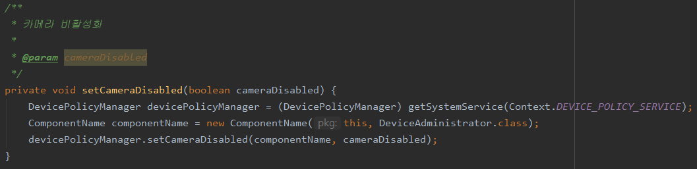

# 설명: 카메라 차단 모바일 앱  

# 실행화면  
<p align="center"><p>  
<p align="center"><p>  
<p align="center"><p>  
<p align="center"><p>  

# 예제: 카메라 기능을 사용하는 앱  
* 국방모바일보안  
<p align="center"><p>  
<p align="center"><p>  
<p align="center"><p>  

# 코드: DevicePolicyManager의 setCameraDisabled 함수 (Deprecated)
* Manifest: 기기 관리자 권한 등록  
<p align="center"><p>  

* xml: 사용할 기능 정의  
<p align="center"><p>  

* 리스너: 기능 요청 처리  
<p align="center"><p>  

* Activity: 기기 관리자 권한 요청, 카메라 차단  
<p align="center"><p>  
<p align="center"><p>  

``` Android 10(Q, API 29)부터는 deprecated되어 앞으로 호환성이나 보안에 문제될 수 있음 ```

# 대안: 기종별 제공하는 API 사용
* 삼성 Knox API  
<p align="center"><p>  
<p align="center"><p>  
<p align="center"><p>  
<p align="center"><p>  
<p align="center"><p>  

  * 카메라 차단 기능은 무료지만, API 사용을 위해 License 인증 서버가 필요  
  * 인증을 위해 스마트폰은 네트워크 연결이 필요하며, 인터넷 연결이 제한될 경우 삼성에서 제공하는 on-permise 서버 사용 가능

